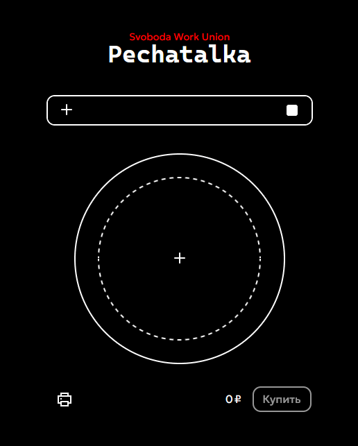

# pechatalka.mjs
Module with merch and print constructor for typrographies

## Example
```html
<section id="title" class="unselectable">
  <h1>Pechatalka</h1>
  <small>Svoboda Work Union</small>
</section>

<section id="pechatalka">
  <section class="system">
    <input id="pechatalka_add_image" type="file" name="images" accept="image/png, image/jpeg, image/webp" multiple="false" onchange="document.getElementById('pechatalka')?.pechatalka.image(this.files[0]);" />
    <input id="pechatalka_background" type="color" name="background" value="#ffffff" oninput="
document.getElementById('pechatalka')?.querySelector('label[for=\'pechatalka_background\']>div.color')?.style.setProperty('--color', event.target.value); document.getElementById('pechatalka')?.pechatalka.canvas.style.setProperty('background-color', event.target.value);" />
  </section>

  <nav class="tools rounded unselectable">
    <label class="button" for="pechatalka_add_image"><i class="icon plus"></i></label>
    <label class="button" for="pechatalka_background">
      <div class="color"></div>
    </label>
  </nav>

  <section class="canvas pin unselectable">
    <label class="button add" for="pechatalka_add_image"><i class="icon plus"></i></label>

    <div class="display"></div>
  </section>

  <section class="result unselectable">
    <button class="print rounded"><i class="icon printer"></i></button>
    <span class="cost">0</span>
    <button class="buy rounded"></button>
  </section>
</section>
```
```js
import("/js/modules/pechatalka.mjs").then((module) => {
  // Initializing the instance
  const instance = new module.pechatalka(
    document.getElementById("pechatalka"),
    document.getElementById("pechatalka")?.querySelector(".canvas"),
    document.getElementById("pechatalka")?.querySelector(".result"),
    true
  );
});
```
CSS in the `/index.css` file

<p float="left">
  
</p>